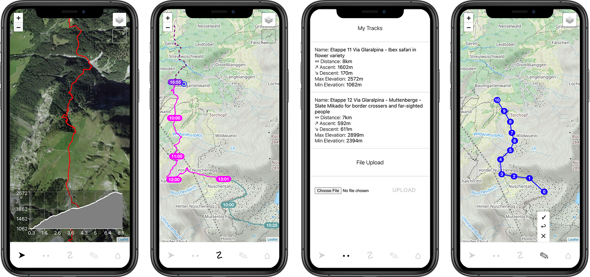

[](http://commitizen.github.io/cz-cli/)

# Pathfinder

<p align="center">
  
</p>

Plan your hiking adventures, multi-day-hikes and through-hikes and organize upcoming hiking days according to your progress.


## Screenshots

<p align="center">
  
</p>

## Getting Started

1. Clone this repo.

    ```bash
    git clone https://github.com/rbrtrfl/pathfinder
    ```

2. Install dependencies in root, server and client folder

    ```bash
    npm install
    ```

3. Create .env file in client folder

    ```bash
    REACT_APP_MAPBOX_TOKEN=
    REACT_APP_THUNDERFOREST_TOKEN=
    REACT_APP_DB_HOST=
    REACT_APP_DB_PORT=
    ```

4. Create .env file in server folder

    ```bash
    DB_HOST=
    DB_PORT=
    DB_PASS=
    DB_USER=
    EXPRESS_HOST=
    EXPRESS_PORT=
    ```

5. Install [MongoDB](https://www.mongodb.com/docs/manual/tutorial/install-mongodb-on-os-x/#installing-mongodb-5.0-edition-edition) on your machine

5. Start the server. From the server folder, run

    ```bash
    npx nodemon
    ```

6. Start the client. From the client folder, run

    ```bash
    npm start
    ```
    
7. Example gpx Tracks can be found in the /gpx folder.

## Tech Stack

* [React](https://reactjs.org/)
* [Leaflet](https://leafletjs.com/)
* [Node.js](https://nodejs.org/)
* [Express](https://expressjs.com/)
* [MongoDB](https://www.mongodb.com/)
* [Mongoose](https://mongoosejs.com/)
